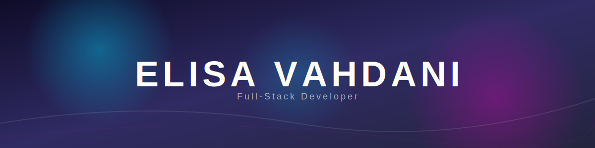

<p align="center">
  
   
</p>

---

```javascript
const response= {
  name: "Elisa Vahdani",
  location: "Tabriz, Iran",
  role: "Software Engineering Student",
  focus: ["Full-Stack Development", "App Development"],
 
 status: "Always learning and building cool things!",
};
```
---


### ✨ About Me

I am a passionate Software Engineering student dedicated to crafting seamless digital experiences. My journey involves bridging the gap between elegant design (UI/UX) and robust backend logic. I thrive on solving complex problems and building scalable applications that make an impact.

### 🌱 Learning Journey

Always curious, constantly learning, and exploring the next frontier of software development

### 🛠️ Tech Stack

<!-- Frontend & Mobile -->


<!-- Backend & Tools -->


### 📊 GitHub Stats


### ✉️ Connect with me

[](YOUR_LINKEDIN_URL)
[](YOUR_TELEGRAM_URL)
[](mailto:YOUR_EMAIL_HERE)

