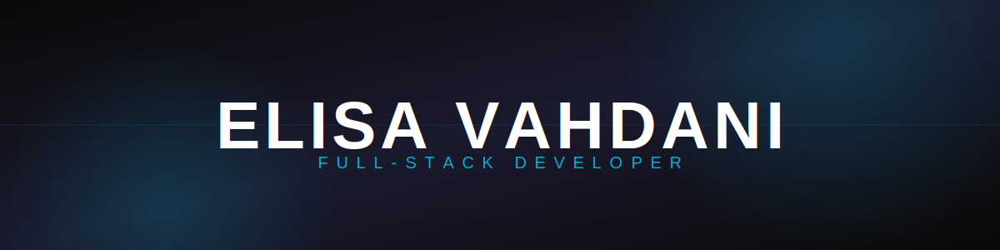

<p align="center">
  
</p>


```javascript
const response= {
  name: "Elisa Vahdani",
  birthDay: "2002 July 2, tuesday",
  location: "Tabriz, Iran",
  focus:"Web Applications",
  "Cross-Platform Applications",
  "WordPress Plugins",
  "Business Software",
  "UI/UX Design"
 status: "Always learning and building cool things!",
};
```
---


### ✨ About Me

I'm a passionate Full-Stack Developer who enjoys turning ideas into modern, scalable digital products. I specialize in building web applications, cross-platform applications, and WordPress plugins, combining clean architecture with intuitive user experiences.
I love solving real-world problems through technology and continuously improving my skills by exploring modern tools, frameworks, and best development practices.

Always curious, constantly learning, and committed to building better software every day.

### 🛠️ Tech Stack

<p align="center">
  
  
  
  
  
  
  
  
  
</p>

### 📊 My Stats


### ✉️ Connect with me

[](YOUR_LINKEDIN_URL)
[](YOUR_TELEGRAM_URL)
[](mailto:YOUR_EMAIL_HERE)

<h2 align="center">📬 Get in Touch</h2>

<p align="center">
  <a href="mailto:your-email@gmail.com">
    
  </a>
  &nbsp;
  <a href="https://www.linkedin.com/in/your-linkedin">
    
  </a>
  &nbsp;
  <a href="https://t.me/your_telegram_username">
    
  </a>
</p>
